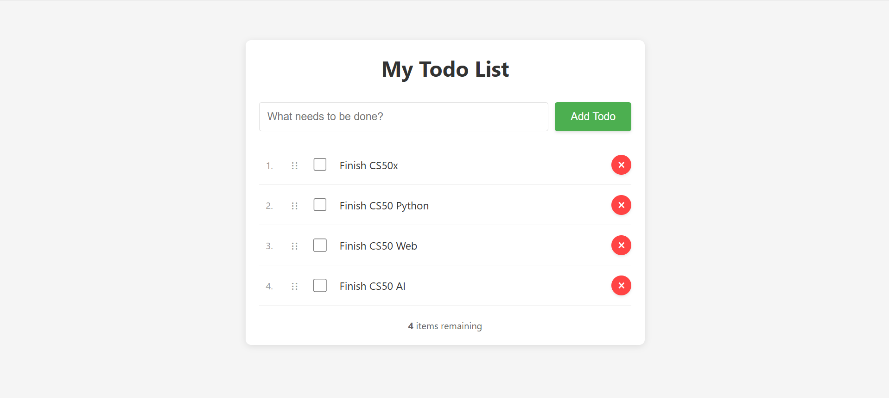

# Simple To-Do App

A clean and functional To-Do application built with vanilla JavaScript, HTML, and CSS.

[Live Demo](https://greg-182.github.io/todo/)

## Features
- Add new tasks
- Mark tasks as complete
- Delete tasks
- Drag and Drop
- Double click to edit tasks
- Responsive design
- Saves to-dos in bowser's memory

## Getting Started
1. Clone the repository
2. Open `index.html` in your web browser
3. Start managing your tasks!

## Technologies Used
- HTML5
- CSS3
- JavaScript (ES6+)

## Screenshot

## License
This project is licensed under the MIT License - see the [LICENSE](LICENSE) file for details.
